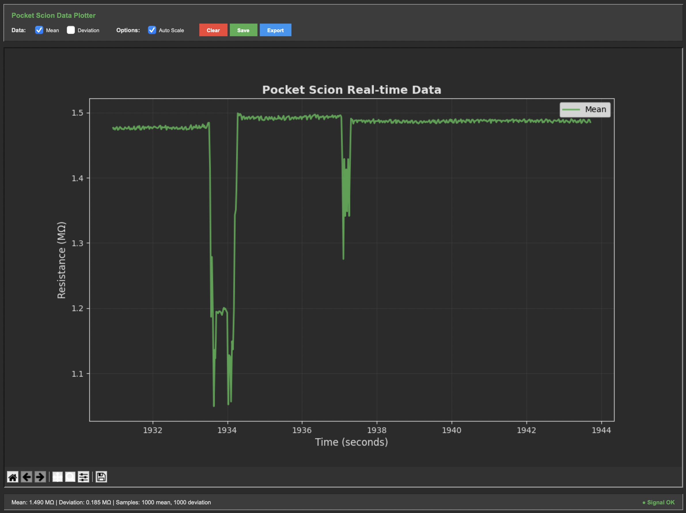

# Pocket Scion Data Plotter

A Python GUI application for real-time plotting and visualization of [Pocket Scion](https://pocketscion.com/) sensor data using OSC (Open Sound Control) communication.



## Features

- **Real-time Data Plotting**: Live visualization of Pocket Scion sensor data
- **Dark Theme**: Modern dark interface for better visibility and reduced eye strain
- **Data Selection**: Choose which data streams to display (Mean, Deviation)
- **Export Capabilities**: Save plots as images and export data to JSON
- **OSC Integration**: Receives data via OSC protocol from Pocket Scion devices
- **Auto-scaling**: Optional automatic scaling of plot axes

## Requirements

- Python 3.7+
- Tkinter (usually included with Python)
- Required Python packages:
  ```bash
  pip install python-osc matplotlib numpy
  ```

## Installation

1. Clone this repository:
   ```bash
   git clone https://github.com/HaraldWalker/PocketScionDataPlotter.git
   cd PocketScionDataPlotter
   ```

2. Install dependencies:
   ```bash
   pip install -r requirements.txt
   ```

3. Run the application:
   ```bash
   python pocket_scion_data_plotter.py
   ```

## Usage

### Prerequisites
Before running the application, you must:

1. **Pocket Scion Hardware**: Ensure you have the Pocket Scion hardware device connected to your computer via USB.

2. **Pocket Scion Controller application**: Install and run the [Pocket Scion Controller](https://pocketscion.com/) application on your computer.

### Running the Application

1. **Prepare Pocket Scion Hardware**: 
   - Ensure the Pocket Scion device is powered and connected
   - Press and hold both [Voices] Sensitivity Buttons for 3 seconds to enable Raw Output Mode
   - Look for white LED animations to confirm raw data is being transmitted
   - Test the device by providing stimulation to verify frequency changes

2. **Launch Data Plotter**: Run the Python script:
   ```bash
   python pocket_scion_data_plotter.py
   ```

3. **Select Data**: Use checkboxes to choose which data streams to display:
   - Mean Data: Shows the mean resistance values
   - Deviation Data: Shows the deviation from mean

4. **Control Display**:
   - **Auto Scale**: Toggle automatic Y-axis scaling
   - **Clear Data**: Reset all data buffers
   - **Save Plot**: Export current plot as PNG image
   - **Export Data**: Save all data to CSV file

5. **Monitor Status**: The status bar shows:
   - Current data values
   - Sample counts
   - OSC signal status

### Troubleshooting Connection Issues

If you see "No Signal" in the status bar:
- Verify Pocket Scion hardware device is powered and connected
- Check that Raw Output Mode is enabled: press and hold both [Voices] Sensitivity Buttons for 3 seconds
- Look for white LED animations to confirm raw data transmission
- Test by providing stimulation to verify the device responds with frequency changes

## Technical Details

### Architecture
- **GUI Framework**: Tkinter with custom dark theme implementation
- **Plotting**: Matplotlib with real-time updates
- **Communication**: Python-OSC library for UDP message handling
- **Threading**: Separate OSC receiver thread to prevent GUI blocking

### Data Processing
- Uses collections.deque for efficient data buffering
- 555 timer constants for resistance conversion:
  - Capacitance: 4300 pF
  - Timer constant: 0.693
  - Reference resistance: 100 kOhm

### Custom Components
- **ClickableLabel**: Custom button implementation to avoid macOS focus styling issues
- **Dark Theme**: Comprehensive color scheme for consistent dark interface

## Troubleshooting

### Common Issues

1. **No OSC Data Connection**
   - Verify Pocket Scion hardware device is powered and connected
   - Ensure Raw Output Mode is enabled: press and hold both [Voices] Sensitivity Buttons for 3 seconds
   - Look for white LED animations to confirm raw data transmission
   - Test by providing stimulation to verify frequency changes are detected
   - Confirm OSC output settings if configurable on hardware (IP: 127.0.0.1, Port: 11045)
   - Ensure firewall allows UDP traffic on port 11045
   - Try disabling and re-enabling Raw Output Mode (hold both buttons for 3 seconds)
   - Power cycle the Pocket Scion device and restart the plotter if needed

2. **Button Styling Issues on macOS**
   - The application uses custom ClickableLabel components to avoid macOS button focus issues
   - If buttons appear unreadable, restart the application

3. **Plot Not Updating**
   - Check OSC signal status in the bottom status bar
   - Verify data selection checkboxes are enabled
   - Ensure Auto Scale is toggled if data range is very small

### Dependencies Issues

If you encounter import errors, try:
```bash
pip install --upgrade python-osc matplotlib numpy
```

For tkinter issues (especially on Linux):
```bash
# Ubuntu/Debian
sudo apt-get install python3-tk

# macOS (tkinter usually included with Python)
# If missing, reinstall Python from python.org

# Windows (tkinter usually included with Python)
# If missing, reinstall Python and ensure "tcl/tk and IDLE" is selected
```

## Development

### Project Structure
```
PocketScionDataPlotter/
|-- pocket_scion_data_plotter.py  # Main application
|-- README.md                      # This file
|-- requirements.txt               # Python dependencies
|-- LICENSE                        # MIT License
```

### Contributing
1. Fork the repository
2. Create a feature branch
3. Make your changes
4. Test thoroughly
5. Submit a pull request

### Code Style
- Follow PEP 8 guidelines
- Use descriptive variable names
- Add comments for complex logic
- Maintain the dark theme consistency

## License

This project is licensed under the MIT License - see the [LICENSE](LICENSE) file for details.

## Acknowledgments

- Pocket Scion project for the sensor hardware and OSC protocol
- Python-OSC library for OSC communication
- Matplotlib for plotting capabilities
- Tkinter for GUI framework

## Contact

For issues, questions, or contributions, please:
- Open an issue on GitHub
- Contact the project maintainer

---

**Note**: This application is designed specifically for Pocket Scion sensor data visualization. It assumes familiarity with the Pocket Scion hardware and OSC data protocols.
