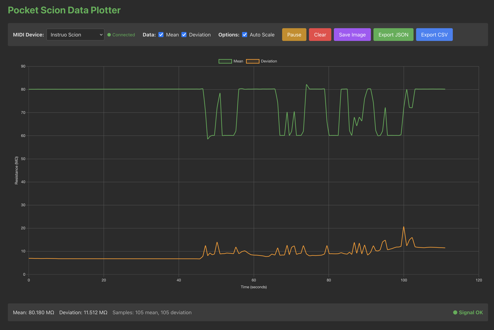

# Pocket Scion Data Plotter - Web Implementation

A modern web application for real-time plotting and visualization of [Pocket Scion](https://pocketscion.com/) sensor data using Web MIDI API for direct hardware communication.

## Status

✅ **Ready** - First version complete and deployed

Live demo available at https://sonicwalker.com/psdp/  



## Features

- **Cross-Platform**: Runs in any modern browser with Web MIDI API support
- **Direct Hardware Access**: Web MIDI API for direct Pocket Scion communication
- **No Controller App**: Reads MIDI sysex directly, eliminating dependency
- **No Backend**: Pure client-side application
- **Real-time Plotting**: Chart.js or Plotly.js for smooth visualization
- **Easy Deployment**: Static hosting, no server costs
- **Modern Tech Stack**: React, TypeScript, Vite

## Requirements

- **Browser**: Chrome/Edge/Opera (full support), Firefox (full support), Safari (partial support)
- **Connection**: HTTPS required for production (localhost OK for development)
- **Hardware**: Pocket Scion device connected via USB

## Browser Compatibility

| Browser | Web MIDI Support | Sysex Support | Notes |
|---------|-----------------|---------------|-------|
| Chrome/Edge/Opera | ✅ Full | ✅ Full | Since 2015 |
| Firefox | ✅ Full | ✅ Full | Since 2020 |
| Safari | ⚠️ Partial | ⚠️ Partial | Check current status |
| iOS Safari | ❌ No | ❌ No | Not supported |
| Mobile Browsers | ❌ No | ❌ No | Not supported |

## Installation

### Development Setup

1. Clone this repository:
   ```bash
   git clone https://github.com/HaraldWalker/PocketScionDataPlotter.git
   cd PocketScionDataPlotter/web
   ```

2. Install dependencies:
   ```bash
   npm install
   ```

3. Start development server:
   ```bash
   npm run dev
   ```

4. Open browser:
   ```
   http://localhost:5173
   ```

### Production Build

```bash
npm run build
```

The built files will be in `dist/` directory, ready for static hosting.

### Environment Configuration

The application uses environment variables for configuration. Copy the example file:

```bash
cp .env.example .env
```

Edit `.env` to configure the base path for deployment:

```env
# Base path for deployment
# For root deployment: VITE_BASE_PATH=/
# For subdirectory deployment (e.g., /psdp/): VITE_BASE_PATH=/psdp/
VITE_BASE_PATH=/
```

- **Root deployment** (e.g., `https://example.com/`): Set `VITE_BASE_PATH=/`
- **Subdirectory deployment** (e.g., `https://example.com/psdp/`): Set `VITE_BASE_PATH=/psdp/`

The `.env` file is excluded from git via `.gitignore` to keep deployment-specific configurations private.

## Usage

### Prerequisites

1. **Pocket Scion Hardware**: Ensure you have the Pocket Scion hardware device connected to your computer via USB.

2. **No Controller App Required**: This implementation reads MIDI sysex directly from the hardware.

3. **Browser Permission**: You must grant MIDI access permission when prompted.

### Running the Application

1. **Prepare Pocket Scion Hardware**: 
   - Ensure the Pocket Scion device is powered and connected
   - Press and hold both [Voices] Sensitivity Buttons for 3 seconds to enable Raw Output Mode
   - Look for white LED animations to confirm raw data is being transmitted

2. **Open Application**: Navigate to the app URL in your browser

3. **Grant MIDI Permission**: Click "Allow" when the browser requests MIDI access

4. **Select Device**: Choose your Pocket Scion from the device list

5. **Monitor Data**: View real-time plots of biofeedback data

## Technical Details

### Architecture

- **Framework**: React 18+ with TypeScript
- **Build Tool**: Vite (fast HMR, optimized builds)
- **State Management**: Zustand or Redux Toolkit
- **Styling**: Tailwind CSS
- **Plotting**: Chart.js or Plotly.js
- **MIDI**: Web MIDI API (native browser API)

### Data Processing

- Uses same 555 timer formula as Python implementation:
  - Capacitance: 4300 pF
  - Timer constant: 0.693
  - Reference resistance: 100 kOhm

### Project Structure

```
web/
├── src/
│   ├── components/              # React components
│   ├── services/                # MIDI, parsing, etc.
│   ├── store/                   # State management
│   ├── utils/                   # Helper functions
│   ├── App.tsx                  # Root component
│   └── main.tsx                 # Entry point
├── public/                      # Static assets
├── package.json
├── vite.config.ts
├── tsconfig.json
└── README.md                    # This file
```

## Development

### Code Style

- Follow React best practices
- Use TypeScript for type safety
- Maintain consistent formatting (Prettier)
- Use functional components with hooks

### Testing

- Unit tests for data processing
- Component tests for UI
- Manual testing with Pocket Scion hardware

## Deployment

### Static Hosting Options

- **GitHub Pages**: Free, easy setup
- **Netlify**: Free tier, automatic deployments
- **Vercel**: Free tier, excellent developer experience
- **Any static hosting**: Nginx, Apache, S3, etc.

### HTTPS Requirement

- Web MIDI API requires HTTPS in production
- Use Let's Encrypt for free SSL certificates
- Most hosting providers provide free HTTPS

### Deployment Steps

1. Build the application:
   ```bash
   npm run build
   ```

2. Upload `dist/` directory to your hosting provider

3. Configure HTTPS (if not automatic)

4. Test with Pocket Scion hardware

## Troubleshooting

### Common Issues

1. **MIDI Permission Denied**
   - Click "Allow" when browser prompts for MIDI access
   - Check browser settings for MIDI permissions
   - Try incognito/private window

2. **Device Not Detected**
   - Ensure Pocket Scion is connected via USB
   - Check Raw Output Mode is enabled
   - Try different USB port or cable
   - Refresh the page

3. **HTTPS Error in Production**
   - Ensure your site is served over HTTPS
   - Check SSL certificate is valid
   - Use localhost for development (HTTP OK)

4. **Safari Compatibility**
   - Safari has limited Web MIDI support
   - Check current Safari implementation status
   - May require iOS 15+ or macOS Safari 15+

### Browser-Specific Issues

**Chrome/Edge/Opera**: Full support, no known issues

**Firefox**: Full support, may need to enable MIDI in `about:config`

**Safari**: Limited support, may not work on all versions

## Limitations

- **Browser Support**: Requires Web MIDI API compatible browser
- **HTTPS Required**: Production deployment needs HTTPS
- **Safari**: Limited support on some versions
- **No Offline**: Requires internet for initial load (can use service worker for offline)

## Resources

- [Web MIDI API - MDN](https://developer.mozilla.org/en-US/docs/Web/API/Web_MIDI_API)
- [Web MIDI API - W3C Spec](https://www.w3.org/TR/webmidi/)
- [React Documentation](https://react.dev/)
- [Vite Documentation](https://vitejs.dev/)
- [Chart.js Documentation](https://www.chartjs.org/)
- [pocket-scion-osc](https://github.com/ucodia/pocket-scion-osc) - Reference for sysex parsing

## Security Considerations

- **HTTPS Required**: Web MIDI API only works in secure contexts
- **User Permission**: Browser prompts for MIDI access
- **No Sensitive Data**: All processing happens locally
- **CORS**: Not applicable (no backend)

## License

This project is licensed under the MIT License - see the [LICENSE](../LICENSE) file for details.
